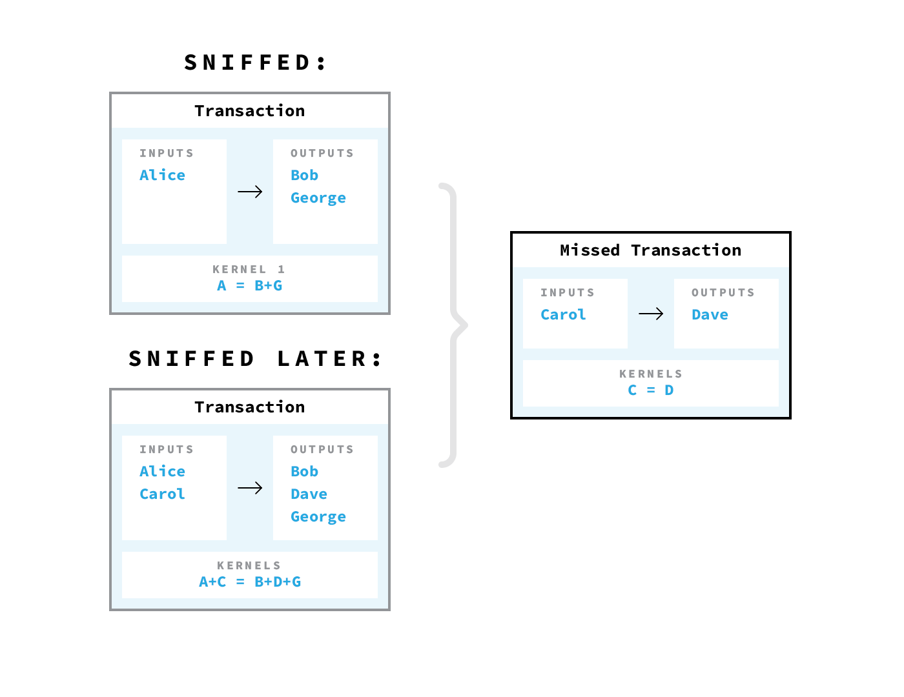
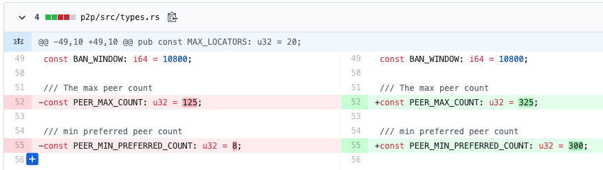

# Linking 96% of Grin transactions

**TL;DR: I modified a Grin full node into a sniffer node that logs all intermediary transaction gossiping data,
including not-yet-aggregated transactions. Using this data, I was able to trace 96% of all Grin transactions,
revealing the transaction graph almost fully and uncovering who paid who in the Grin network.
For a longer summary, check out the FAQ at the end.**

Grin, a privacy coin with a design that's uniquely distinct from either ZCash or Monero, has been the most mysterious
cypherpunk project since Bitcoin itself. It started with MimbleWimble, a protocol specification that was published
anonymously on a Tor hosting service in 2016. Later, an anonymous team of developers working under Harry Potter-themed
names banded together and decided to implement MimbleWimble in a cryptocurrency, now called Grin. Grin's mainnet
launched in January 2019 after two years of development. Following the spirit of Satoshi Nakamoto, Grin did a
"fair launch" with no premine, no developer reward and no investors.

### How Grin achieves privacy

Let's start by describing the protocol. At first glance, Grin is similar to Bitcoin: both use proof-of-work and the
[UTXO model](https://bitcoin.org/en/glossary/unspent-transaction-output) for payments.
But Grin has four key new features that aim to enhance its privacy.

1. Grin uses the same Confidential Transactions (CT) protocol as Monero to **hide the amount** of each UTXOs.
2. All transactions in a block are aggregated together, essentially making each block one giant
[CoinJoin](https://bitcoinmagazine.com/articles/coinjoin-combining-bitcoin-transactions-to-obfuscate-trails-and-increase-privacy-1465235087/).
As a result, each block is a single bundle of inputs and outputs, allowing to **hide the transaction graph**,
with no easy way to determine who paid who within a block.
3. There are no addresses, only UTXOs hidden as Pedersen commitments. One downside of this approach is that
the sender and the receiver need to communicate with each other off-chain (which makes wallet implementations and
exchange integrations more complex).
4. Grin uses "patient Dandelion", an enhanced version of Bitcoin's Dandelion proposal, which **hide the IP addresses**
that originated any given transaction.

The first part, hiding transaction amounts, is beyond the scope of this post. For a detailed overview of this part of
the protocol, check out [this](https://medium.com/@brandonarvanaghi/grin-transactions-explained-step-by-step-fdceb905a853)
excellent post by Brandon Arvanaghi. The short version is that amounts are hidden as
commitments and every transaction has a "kernel", which proves the transaction's inputs sum up to the same value as the
transaction's outputs (in other words, no new money was created out of thin air).

In Bitcoin, for example, you might have a transaction with one input and two outputs:
`(UTXO1, amount1) -> (UTXO2, amount2), (UTXO3, amount3)`.
The values `amount1, amount2, amount3` are public, known to everyone, and every full node checks that
`amount1 = amount2 + amount3` before accepting the transaction.
In Grin, the transaction will look as `(Commitment1 -> Commitment2, Commitment3; Kernel123)`.
While the amounts of money hidden behind the commitments are unknown, `Kernel123` is a zero-knowledge proof that
`Commitment1 = Commitment2 + Commitment3` (whatever the amounts actually are),
and further that the numbers are non-negative.

*Transactions get aggregated together and mined into blocks*

The second privacy feature, merging all transactions together to hide the transaction graph,
is arguably Grin's most important.
If the transaction graph itself is perfectly hidden, hiding the amounts is less important – the only thing that can be
gleaned by seeing anonymous amounts flying around is the total daily transaction volume.
However, if the transaction graph can be uncovered, even with the amounts hidden, an observer can still extract
tons of metadata and uncover the flow of payments.
Say I’m law enforcement, and I know that an address belongs to a vendor on a darknet market.
When you send your Grin coins to Coinbase, Coinbase links your address with your name.
Since I can see the entire transaction graph, I now know you did business with a darknet market,
and I can indict you for purchasing illegal goods.

The transaction graph is precisely what we target in this attack,
so let me now explain how Grin aims to hide it in more detail.

Grin's approach to anonymization is similar to Bitcoin's
[CoinJoin](https://bitcoinmagazine.com/articles/coinjoin-combining-bitcoin-transactions-to-obfuscate-trails-and-increase-privacy-1465235087),
a privacy technique that merges inputs and outputs from several participants. Unlike Bitcoin, in Grin the participants
do not need to collaborate interactively to merge their transactions. Any two transactions can be merged by anyone
while en route in the P2P network (and then merged further with any other incoming transactions).
The only thing that remains are the kernels, which are required to prove that all the inputs sum up to all the outputs,
and that no new money was printed during the merge.

These kernels will later allow us to evaluate the success of the attack. Every user-issued transaction has
a single kernel, and as transactions are merged, the kernels are concatenated.
Imagine a certain block has 3 kernels, 10 inputs and 15 outputs. If not for the kernels, it could have been
a block with 10 transactions. But given there were only 3 kernels, we know we only need to group the inputs and outputs
into 3 buckets (belonging to 3 senders).

### Transaction broadcasting and Dandelion

[Research](https://arxiv.org/abs/1701.04439) shows that broadcasting transactions naively allows observers to
link transactions to their originating IP addresses, which is precisely what firms like Chainalysis do to deanonymize
Bitcoin transactions.

Dandelion is a proposal to fix this through a two-phase approach to gossiping transactions.
First, there is a "stem" phase, followed by a more normal "fluff" phase (hence "dandelion").
In stem phase, the transaction is passed to a single random peer node, which forwards it to another random peer node,
until the transaction is likely some large distance away from its originator in the node network.
After that, the transaction enters the fluff phase and is broadcasted to all the available nodes on the network.
This breaks the link between the propagator of a transaction and its originator.

Grin further modifies this protocol to a version they call "patient Dandelion", which not only protects
the sender's IP address, but also holds transactions in "stem" phase for some time (~10 per each hop on the stem path).
This gives transactions a chance to aggregate with other transactions before they are broadcast widely.

*How transactions propagate with Dandelion. Stem phase (maximizing anonymity) followed by fluff phase (maximizing spread)*

The attack uncovers the transaction graph in Grin and does not attempt to uncover the IP addresses.
Given that Dandelion protects IP addresses, it may seem unrelated to the attack.
However, the different transaction propagation under Dandelion is exactly the reason we can trace ~96% of the
transactions (as opposed to ~100%), and so an understanding of Dandelion will come in handy later.

### Explanation of the attack

The simplest version of the attack is to run a Grin full node modified to log all the transactions it encounters
(let's call this a **sniffer node**). In particular, we're logging all of the intermediary pending transactions
that are gossiped around before a block is finalized and aggregated into a single mega-transaction.
If a certain transaction is encountered before it is merged with others, a sniffer node can establish a direct link
between its inputs and outputs.

*Logger plugged into grin/servers/src/common/hooks.rs. There are several places where transactions are handled in the codebase, but this hook allows to store pending transactions as well as confirmed ones, basically everything the node ever processes. The fancy syntax is just Rust's version of printing a vector.*

Even if we don't manage to sniff a particular transaction in the wild, by keeping a full log we can trace
some of them retroactively, by using partial information to infer progressively more and more information about
the transaction graph. For example, let's say `TransactionA` was broadcast and sniffed by the sniffer node.
Later, `TransactionB` was produced by another user and merged with `TransactionA` in-flight.
The sniffer node may have never seen `TransactionB` itself, but sniffing `TransactionA` as well as the merge of
`TransactionA+B` is sufficient to uncover the inputs and outputs that belong to `TransactionB`.
In other words, we can derive `TransactionB` with the equation: `TransactionB = TransactionA+B - TransactionA`.

*"Tracing by subtraction" progressive linking as the sniffer node accumulates data*

To increase the percentage of sniffed transactions, a sniffer node should have as many peers as possible,
to encounter every transaction as early as possible, before it was merged at some stage in the network.
With sufficiently high bandwidth, it is possible to connect to every node on the network as its peer, becoming
a so-called **supernode**.
Such a supernode would immediately encounter every transaction as it enters the "fluff" phase.

*Peer count is important for sniffing transactions before they were merged with others and anonymized. The preferred peer count is more relevant here, and 8 is way too small for our nefarious purposes.*

In practice, any node with a fairly large number of peers, **should be able to trace almost every Grin transaction**.
The only transactions we cannot trace are the transactions that happened to collide on each other's stem paths,
and were merged there. Even then, running several supernodes gives an attacker a high probability of placing themselves
onto every stempath, thus further tracing even the remaining tiny percentage.
As an alternative to the complex business of maintaining a supernode, an attacker could instead flood the network
with regular nodes: if an attacker controls a large percentage of all nodes in the network, the probability that
every transaction passes one of their sniffer nodes approaches 100%.

**`<Dandelion with a sniffer supernode GIF>`**

### Methodology and results

In practice, I had been running 3 sniffer nodes with ~200 peers for a period from May 10 until May 15.
Two were high-bandwidth AWS nodes, and another I rented on Hetzner.
Each of the nodes was logging the full composition of every pending transaction it encountered:
the inputs, the outputs and the kernels.

During that time frame (roughly block `164696` to block `170350`), Grin users have sent a total of `8843` transactions.
Recall that transactions have kernels that persist through merging, so we can calculate the total number of transactions
by adding up the number of kernels in each block from `164696` to `170350`.
Out of those `8843` transactions, the sniffer nodes immediately caught `8438-8447` before they could merge with any
other transactions, which translates to ~95.5%.

An unexpected empirical result was that "tracing by subtraction" added practically no improvement:
out of `8843` thousand transactions, only `~5-10` were traced by subtraction, the rest were sniffed independently.
This means the sniffer nodes are very good at capturing all fluff-phase transactions before any of them are merged
with any other fluff-phase transactions.
Theoretically, the only transactions we truly cannot trace are the ones that happened to merge while both of them
were in stem-phase. Given a typical stem path length is ~10 nodes, this means two transactions have at least
one node in common in their stem paths, out of [thousands](http://grin-map.cycle42.com/) of nodes on the network.

The logs from the 3 machines and the code analyzing it are published here.
Feel free to reproduce my numbers or play around further. 
Or, if you used Grin between May 10 and 15, you may be able to find yourself in the logs. ;)

### Final thoughts

Getting privacy right is extremely hard, as this research demonstrates.
Even a single flaw in a protocol design can lead to almost the entire transaction graph being reconstructed.
Luckily the Grin core devs were aware [LINK] that such an attack was theoretically possible, even if the extent
and possible solutions were unclear. Mohamed Fouda hypothesized a similar attack in his excellent Grin
[overview](https://www.tokendaily.co/blog/mimblewimble-the-good-and-the-bad).
In practice, this attack downgrades Grin's privacy to that of Bitcoin with mandatory address reuse and hidden
amounts—which may actually be sufficient for many use cases!

Beam, another cryptocurrency built following the MimbleWimble protocol, is similarly vulnerable to the best of my understanding. Compared to Grin, Beam has an extra privacy feature, namely decoy outputs produced to obfuscate the real ones. However, all these decoys still have to belong to the same user, which (compared to Monero) limits how much the transaction graph can be actually obfuscated. In other words, if Alice paid Bob using BEAM, the graph link would still be undeniably present.

Another good way to frame this attack is to compare it with previous attacks on Monero (
[one](https://arxiv.org/pdf/1704.04299/), [two](https://eprint.iacr.org/2017/338.pdf)).
Recall that Monero creates a large anonymity set at the cost of wasted HDD space (in extra on-chain decoys),
whereas Grin achieves a large anonymity set by time wasted in patient Dandelion.
After the Monero attack was discovered, it was resolved by increasing the mandatory minimum number of decoys,
which is another way of saying: we didn't pay enough in HDD space. So in Grin, it's possible that a reasonable way
to lower the 96% traceability rate is to increase the Dandelion patience timer, implying that Grin users have not
been paying enough in time to achieve a sufficiently large anonymity set.

### FAQ

* Q1
    * answer1
* Q2
    * answer2